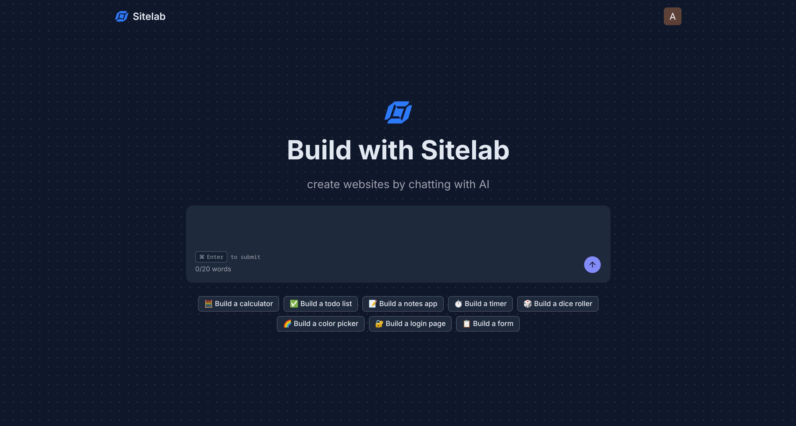

# Sitelab

> **AI-powered website generation platform that turns natural-language prompts into working Next.js applications.**

Sitelab is a vibe-coding platform that lets users describe what they want to build in natural language. An AI agent powered by Claude can create, inspect, modify, and run code inside an isolated E2B sandbox, while BullMQ handles long-running AI workloads and Redis Pub/Sub + SSE provides real-time execution updates.

The platform also maintains **project-level AI memory**, allowing users to continue working on the same application across multiple prompts without requiring the agent to reconstruct the entire project history every time.

## Live Project Access

- [https://sitelab.amangupta.work](https://sitelab.amangupta.work)

## Screen Shots

<div style="display: flex; gap: 15px;">
  
  
</div>

---

## Table of Contents

- [Key Features](#key-features)
- [Architecture](#architecture)
- [End-to-End Prompt Lifecycle](#end-to-end-prompt-lifecycle)
- [AI Agent Architecture](#ai-agent-architecture)
- [E2B Sandbox Architecture](#e2b-sandbox-architecture)
- [Asynchronous AI Processing with BullMQ](#asynchronous-ai-processing-with-bullmq)
- [Real-Time Updates with Redis Pub Sub & SSE](#real-time-updates-with-redis-pub-sub--sse)
- [Project-Level AI Memory](#project-level-ai-memory)
- [Memory Format](#memory-format)
- [Memory Evolution Across Prompts](#memory-evolution-across-prompts)
- [Data Model](#data-model)
- [Failure Handling](#failure-handling)
- [Security](#security)
- [Technology Stack](#technology-stack)
- [Repository Structure](#repository-structure)
- [Engineering Decisions](#engineering-decisions)
- [Engineering Challenges & Solutions](#engineering-challenges--solutions)
- [Future Improvements](#future-improvements)
- [Author](#author)

## Key Features

- **Natural-language development** — describe an application or feature using a prompt instead of manually writing the initial implementation.
- **Agentic code generation** — Claude can inspect the project, create files, modify existing files, and execute commands.
- **Isolated code execution** — generated applications run inside E2B-managed sandboxes.
- **Prebuilt development environment** — E2B sandboxes are initialized from a custom Next.js template.
- **Asynchronous AI processing** — long-running generation tasks are processed through BullMQ workers.
- **Real-time execution updates** — Redis Pub/Sub and Server-Sent Events (SSE) communicate job completion/status back to the browser.
- **Project-level memory** — Gemini summarizes execution history into structured project context.
- **Iterative development** — subsequent prompts receive the project's existing memory so the agent can continue modifying the application.
- **Tool execution history** — tool calls, affected files, success state, and summaries are persisted as part of the project conversation.
- **Authentication and project ownership** — protected application routes are authenticated using Clerk.
- **CI/CD Using Github Actions** — Managing deployment CI/CD using github actions

---

# Architecture

## High-Level Architecture

```text
                         ┌─────────────────────┐
                         │      Next.js        │
                         │      Frontend       │
                         └──────────┬──────────┘
                                    │
                              HTTP / SSE
                                    │
                                    ▼
                         ┌─────────────────────┐
                         │      Node.js        │
                         │       API           │
                         └──────┬───────┬──────┘
                                │       │
                         create job     │ SSE subscription
                                │       │
                                ▼       ▼
                         ┌──────────┐  ┌──────────────┐
                         │ BullMQ   │  │ Redis Pub/Sub│
                         └────┬─────┘  └──────▲───────┘
                              │               │
                              ▼               │
                     ┌─────────────────┐      │
                     │  Worker Process │──────┘
                     │   (same repo)   │
                     └───────┬─────────┘
                             │
                  ┌──────────┼──────────┐
                  │          │          │
                  ▼          ▼          ▼
              Claude       E2B       Gemini
               Agent      Sandbox     Memory
                  │          │          │
                  └─────┬────┘          │
                        │               │
                        ▼               ▼
                  Generated App    Project Memory
                        │               │
                        └───────┬───────┘
                                ▼
                            MongoDB
```

Sitelab separates the user-facing API from the long-running AI execution workflow.

The API is responsible for request validation, authentication, project/message persistence, queueing, and SSE connections. A separate worker process consumes BullMQ jobs and orchestrates the AI agent, E2B sandbox, tool execution, and project-memory generation.

The API and worker live inside the same backend application/package but run as separate processes.

---

# End-to-End Prompt Lifecycle

When a user submits a prompt, Sitelab processes it through the following pipeline.

```text
User Prompt
     │
     ▼
Frontend
     │
     │ HTTP request
     ▼
Node.js API
     │
     ├── Authenticate request
     ├── Validate input
     ├── Create/update project
     ├── Store message
     └── Add BullMQ job
             │
             ▼
          BullMQ
             │
             ▼
        Worker Process
             │
             ├── Create E2B sandbox
             ├── Load project memory
             ├── Send prompt to Claude
             ├── Execute agent tools
             ├── Generate preview
             └── Generate project memory
                     │
                     ▼
                  MongoDB
                     │
                     ▼
               Redis Pub/Sub
                     │
                     ▼
                    SSE
                     │
                     ▼
                 Frontend
```

### 1. Prompt Submission

The user enters a natural-language prompt and submits it from the frontend.

The frontend sends the prompt to the backend API.

### 2. Project and Message Persistence

After authentication and validation, the backend creates or updates the project state.

The user prompt is persisted as a message associated with the project.

The prompt is then added to the AI processing queue.

### 3. Queue Processing

A separate worker process consumes the BullMQ job.

The worker is responsible for the complete AI execution lifecycle.

### 4. E2B Sandbox Initialization

The worker creates an E2B sandbox from a prebuilt Next.js template.

This provides the AI agent with a known development environment containing the required Next.js setup.

### 5. Claude Agent Execution

The worker sends Claude:

- A system prompt describing the development environment and execution rules
- The current project memory, if available
- The user's latest prompt

Claude then decides which tools it needs to use.

### 6. Tool Execution

When Claude requests a tool, the worker executes that tool against the E2B sandbox.

The tool result is returned to Claude, allowing the agent to continue its execution loop.

### 7. Completion

Once Claude no longer requests tools, it produces its final response.

The worker then retrieves the E2B preview URL for the generated Next.js application.

### 8. Real-Time Client Update

The worker publishes the relevant completion event through Redis Pub/Sub.

The API receives the event through its Redis subscription and forwards it to the frontend through SSE.

### 9. Project Memory Generation

The worker summarizes the execution history using Gemini and stores the resulting project memory in MongoDB.

This memory is then available to the next prompt.

---

# AI Agent Architecture

Sitelab uses Claude as an agent rather than treating the model as a simple text-to-code generator.

Claude is given access to a controlled set of tools that allow it to interact with the project inside the E2B sandbox.

```text
                 User Prompt
                      │
                      ▼
               ┌────────────┐
               │   Claude   │
               │    Agent   │
               └─────┬──────┘
                     │
              Tool required?
                /         \
              Yes          No
               │            │
               ▼            ▼
        Execute Tool     Final Response
               │
               ▼
         Tool Result
               │
               └──────────────► Claude
                                  │
                                  ▼
                           Continue Loop
```

The execution continues until Claude determines that it no longer needs additional tools (a hard limit of 20 iterations is set to avoid infinite looping in case of recorrring claude error and un-necessary token usage).

## Available Agent Tools

| Tool           | Purpose                                                    |
| -------------- | ---------------------------------------------------------- |
| `read_file`    | Reads one or more files from the project                   |
| `write_files`  | Creates or overwrites multiple files                       |
| `update_files` | Applies precise find-and-replace updates to existing files |
| `run_command`  | Executes a shell command inside the project sandbox        |

### `read_file`

Used when the agent needs to inspect existing implementation before making changes.

### `write_files`

Allows the agent to create or overwrite multiple files in one operation.

### `update_files`

Allows targeted modifications using exact `find` / `replace` operations instead of rewriting entire files.

### `run_command`

Allows the agent to execute commands inside the sandbox, such as installing dependencies or validating the generated application.

---

# E2B Sandbox Architecture

Sitelab uses E2B to isolate AI-generated application code from the main application infrastructure.

Before runtime execution, a reusable E2B template is prepared with the required Next.js environment.

```text
              Prebuilt E2B Template
                       │
                       ▼
                  New Sandbox
                       │
              ┌────────┴────────┐
              │                 │
           Next.js           Tooling
           Project          Environment
              │                 │
              └────────┬────────┘
                       ▼
                  Claude Agent
                       │
              ┌────────┴────────┐
              │                 │
           File Ops          Commands
              │                 │
              └────────┬────────┘
                       ▼
                 Generated App
                       │
                       ▼
               Next.js Dev Server
                       │
                       ▼
                  Preview URL
```

Using a prebuilt template avoids having to configure a completely new Next.js environment from scratch for every generation request.

The agent interacts with the project through the defined tools, while the generated application itself runs inside the E2B sandbox.

---

# Asynchronous AI Processing with BullMQ

AI generation is a long-running workflow involving:

- LLM requests
- Multiple tool calls
- File operations
- Shell commands
- Sandbox initialization
- Application generation
- Memory summarization

Keeping the entire workflow inside the original HTTP request would tightly couple request handling to a potentially long-running process.

Sitelab therefore separates prompt submission from AI execution using BullMQ.

```text
HTTP Request
     │
     ▼
Node.js API
     │
     │ Add Job
     ▼
BullMQ / Redis
     │
     ▼
Worker Process
     │
     ├── Initialize E2B
     ├── Execute Claude Agent
     ├── Execute Tools
     ├── Generate Preview
     └── Generate Memory
```

The worker is started independently from the API using the backend application's worker entry point.

For example, the backend exposes a worker process through:

```json
{
  "worker": "tsx watch src/workers/index.ts"
}
```

This allows the API and worker to have separate runtime responsibilities while sharing the same backend codebase.

---

# Real-Time Updates with Redis Pub Sub & SSE

Sitelab uses Server-Sent Events to communicate asynchronous execution results back to the browser.

Redis Pub/Sub acts as the communication layer between the worker and the API handling the SSE connection.

```text
                    ┌───────────────┐
                    │     Worker    │
                    └───────┬───────┘
                            │
                     Publish Event
                            │
                            ▼
                    ┌───────────────┐
                    │ Redis Pub/Sub │
                    └───────┬───────┘
                            │
                      Redis Channel
                            │
                            ▼
                    ┌───────────────┐
                    │   Node.js API │
                    │ SSE Endpoint  │
                    └───────┬───────┘
                            │
                       SSE Stream
                            │
                            ▼
                    ┌───────────────┐
                    │    Browser    │
                    └───────────────┘
```

### Flow

1. The client establishes an SSE connection.
2. The API subscribes to the appropriate Redis channel.
3. The worker processes the AI job.
4. When the relevant execution event occurs, the worker publishes a message to Redis.
5. The API receives the message through its Redis subscription.
6. The API forwards the event through the active SSE connection.
7. The frontend updates the UI.

This keeps the long-running AI execution independent from the browser connection while still providing real-time feedback.

---

# Project-Level AI Memory

One of the core features of Sitelab is persistent project memory.

A project can contain many prompts:

```text
Prompt 1 → Build a dashboard
Prompt 2 → Add Navigation Bar
Prompt 3 → Add dark mode
...
```

For the agent to modify the application correctly, it needs to understand what has already been implemented.

Instead of repeatedly passing the entire execution history to Claude, Sitelab maintains a structured project-level memory.

## Memory Generation

During an AI execution, tool calls are collected in memory.

For example:

```text
Tool Execution History

1. read_file
   Files affected: package.json
   Summary: Inspected project dependencies

2. write_files
   Files affected: app/page.tsx, components/Hero.tsx
   Summary: Created landing page and hero component

3. run_command
   Files affected: []
   Summary: Started Next.js development server
```

After the execution completes, this information is passed to Gemini to produce a standardized project-memory representation.

```text
Tool Execution History
          │
          ▼
       Gemini
          │
          ▼
 Structured Project Memory
          │
          ▼
       MongoDB
```

---

# Memory Format

The generated memory follows a consistent structure:

```json
{
  "projectGoal": "string",
  "currentState": "string",
  "completedFeatures": ["string"],
  "pendingFeatures": ["string"],
  "architecture": ["string"],
  "userPreferences": ["string"],
  "knownIssues": ["string"],
  "importantFiles": ["string"],
  "lastTask": "string"
}
```

### Memory Fields

| Field               | Purpose                                           |
| ------------------- | ------------------------------------------------- |
| `projectGoal`       | Overall goal of the project                       |
| `currentState`      | Current implementation state                      |
| `completedFeatures` | Features already implemented                      |
| `pendingFeatures`   | Known remaining work                              |
| `architecture`      | Important architectural decisions                 |
| `userPreferences`   | Persistent user/design/implementation preferences |
| `knownIssues`       | Known bugs or unresolved problems                 |
| `importantFiles`    | Files that are relevant to future modifications   |
| `lastTask`          | Most recently completed task                      |

---

# Memory Evolution Across Prompts

The memory is not static.

After every subsequent prompt, Sitelab combines the previous project memory with the latest execution history and asks Gemini to generate an updated representation.

```text
                 Previous Memory
                       │
                       │
User Prompt ───────────┼──────────┐
                       │          │
                       ▼          │
                  Claude Agent    │
                       │          │
                       ▼          │
                Tool Executions   │
                       │          │
                       ▼          │
                    Gemini ◄──────┘
                       │
                       ▼
              Updated Project Memory
                       │
                       ▼
                    MongoDB
```

This gives the agent persistent context across prompts without requiring the complete raw execution history to be included in every Claude request.

---

# Data Model

Sitelab uses MongoDB to persist project state, messages, execution information, and project memory.

The primary relationships can be represented as:

```text
User
 │
 └── Project
       │
       ├── Messages
       │      │
       │      └── Execution Log
       │             ├── Tool Calls
       │             ├── Files Affected
       │             ├── Success
       │             └── Summary
       │
       └── Project Memory
```

## Project

A project represents an application being built by the user.

Important information includes:

- Project name
- User ownership
- Creation/update timestamps
- Total prompt count
- Preview URL
- E2B sandbox ID
- Associated messages

## Message

Messages represent the conversation between the user and the agent.

A message can contain an execution log with:

- Initial prompt
- Final agent response
- Tool calls
- Files affected by each tool
- Tool success/failure
- Tool execution summary

This provides a persistent record of what the agent actually did during an execution.

## Project Memory

Project memory is stored separately and references the project.

It contains the structured context generated by Gemini and used to provide continuity between prompts.

---

# Failure Handling

Sitelab distinguishes between failures that the agent can recover from and failures that require reporting an error to the user.

## Agent Recoverable Failures

Tool execution errors are returned to Claude as tool results.

For example:

```text
Claude
  │
  │ read_file("Button.tsx")
  ▼
E2B
  │
  │ File does not exist
  ▼
Tool Result
  │
  │ Error information
  ▼
Claude
  │
  ├── Try another file
  ├── Create the missing file
  └── Change its approach
```

Instead of immediately terminating the execution, the error becomes part of the agent's context.

This allows Claude to decide how to recover from the failure.

## Unrecoverable Failures

If an error occurs outside the agent's ability to recover, Sitelab creates an error response that is persisted and communicated back to the client.

```text
Worker
   │
   ▼
Unrecoverable Error
   │
   ▼
Error Message
   │
   ├── Persist
   │
   └── Publish through Redis
              │
              ▼
             SSE
              │
              ▼
            User
```

---

# Security

Sitelab's main security boundaries are based on authenticated access and isolated code execution.

## Authentication

Protected routes require authentication through Clerk.

Project operations are performed in the context of the authenticated user.

## Isolated Code Execution

AI-generated application code is executed inside E2B-managed sandboxes rather than directly on the main application server.

The agent interacts with the generated project through a controlled set of tools.

> **INFO: As of now the generated E2B sandbox has a limited life of 20 mins, beyond that the user session is terminated. The feature to restart the session is in developlent**

---

# Technology Stack

| Layer                     | Technology         | Purpose                                |
| ------------------------- | ------------------ | -------------------------------------- |
| Frontend                  | Next.js            | Sitelab client application             |
| Backend                   | Node.js            | API and orchestration                  |
| Language                  | TypeScript         | Application development                |
| Monorepo                  | Turborepo + pnpm   | Repository and dependency management   |
| Database                  | MongoDB            | Persistent project and execution state |
| Queue                     | BullMQ             | Asynchronous AI job processing         |
| Queue / Messaging Backend | Redis              | BullMQ backend and Pub/Sub             |
| Authentication            | Clerk              | User authentication                    |
| AI Agent                  | Claude / Anthropic | Code generation and agentic execution  |
| Memory Generation         | Gemini             | Project-memory summarization           |
| Code Execution            | E2B                | Isolated application sandboxes         |
| Realtime Communication    | SSE                | Server-to-client execution updates     |

---

# Repository Structure

Sitelab is organized as a Turborepo monorepo using pnpm.

```text
sitelab/
├── apps/
│   ├── frontend/
│   └── backend/
│       └── src/
│           ├── ...
│           └── workers/
│
├── package.json
├── pnpm-workspace.yaml
├── turbo.json
└── README.md
```

### Applications

#### `apps/frontend`

Contains the Next.js frontend application.

Responsibilities include:

- Project creation UI
- Prompt input
- AI execution/status display
- SSE client
- Generated application preview

#### `apps/backend`

Contains the Node.js backend.

Responsibilities include:

- Authentication
- API routes
- Project/message persistence
- BullMQ job creation
- Worker implementation
- Claude orchestration
- E2B integration
- Gemini memory generation
- Redis Pub/Sub
- SSE endpoints

The backend worker is executed as a separate process from the API while sharing the same codebase.

---

<!-- # Local Development

## Prerequisites

Make sure the following are available:

- Node.js
- pnpm
- MongoDB
- Redis
- Clerk account
- Anthropic API access
- Gemini API access
- E2B account/API access

> **TODO: Add exact Node.js and pnpm versions if the project depends on specific versions.**

## Installation

Clone the repository:

```bash
git clone <YOUR_REPOSITORY_URL>
cd sitelab
```

Install dependencies:

```bash
pnpm install
```

## Environment Variables

> **TODO: Add the actual environment variable names used by the frontend and backend.**

Example structure:

```env
# Frontend
NEXT_PUBLIC_...

# Backend
MONGODB_URI=...
REDIS_URL=...
ANTHROPIC_API_KEY=...
GEMINI_API_KEY=...
E2B_API_KEY=...
CLERK_SECRET_KEY=...
```

Never commit real credentials or secrets to the repository.

## Start the Applications

> **TODO: Replace these commands with the exact scripts from the repository.**

Start the frontend:

```bash
pnpm dev
```

Start the backend API:

```bash
pnpm --filter backend dev
```

Start the worker:

```bash
pnpm --filter backend worker
```

--- -->

# Engineering Decisions

## Why BullMQ?

AI generation is a long-running workflow involving multiple external systems and potentially many tool executions.

Using BullMQ separates prompt submission from execution, allowing the API to enqueue work while a worker handles the expensive workflow.

This also provides a natural foundation for retries and independent worker scaling as workload increases.

## Why E2B?

Generated code needs to execute somewhere.

Running AI-generated code directly on the main application server would create an undesirable security and resource boundary.

E2B provides managed isolated sandboxes where each generated application can run independently from the Sitelab backend.

## Why Redis Pub/Sub + SSE?

The AI workflow runs asynchronously, but the frontend still needs to receive updates.

Redis Pub/Sub provides communication between the worker and API process, while SSE provides a simple server-to-client streaming mechanism to the browser.

This avoids coupling the browser connection directly to the worker process.

## Why Project-Level Memory?

A project can contain many prompts and potentially hundreds of tool executions.

Sending the complete raw execution history to the agent on every request would increase context size and make the prompt increasingly expensive and noisy.

Sitelab instead maintains a compact structured representation of the project's current state.

Gemini regenerates this memory after each execution using the previous memory and the latest execution history.

## Why Separate Tool Operations?

Rather than giving the agent unrestricted access to the sandbox through a generic interface, Sitelab exposes a small set of explicit operations:

- Read files
- Write files
- Update files
- Run commands

This gives the agent enough capability to develop an application while keeping the integration explicit and observable.

---

# Engineering Challenges & Solutions

## Long-Running AI Workflows

**Challenge:** AI generation can involve multiple LLM calls, tool executions, shell commands, and sandbox operations.

**Solution:** Decouple request handling from execution using BullMQ and a dedicated worker process.

---

## Executing AI-Generated Code

**Challenge:** Generated applications need to be executed to provide a working preview.

**Solution:** Run generated projects inside isolated E2B sandboxes instead of directly on the backend server.

---

## Real-Time Execution Feedback

**Challenge:** The AI workflow happens asynchronously, but users need to know when processing completes.

**Solution:** Use Redis Pub/Sub to communicate between worker and API processes and SSE to stream events to the browser.

---

## Maintaining Context Across Prompts

**Challenge:** The agent needs to understand what it previously implemented when a user submits another prompt.

**Solution:** Summarize execution history into structured project memory using Gemini and persist it per project.

---

## Recovering From Tool Errors

**Challenge:** An agent may attempt an invalid operation, such as reading a file that does not exist.

**Solution:** Return tool execution errors to Claude as tool results so the agent can decide how to recover instead of immediately terminating the workflow.

---

# Future Improvements

Potential future improvements include:

- Project and sandbox persistence/restoration
- Improved memory retrieval and context selection
- Better agent planning before tool execution
- Project export
- Multi-agent workflows

---

# Author

**Aman Gupta**

Senior Software Development Engineer

- [GitHub](https://github.com/Aman-Gupta-404)
- [LinkedIn](https://www.linkedin.com/in/amangupta3/)
<!-- - [Portfolio / Personal Website](https://your-website.com) -->
